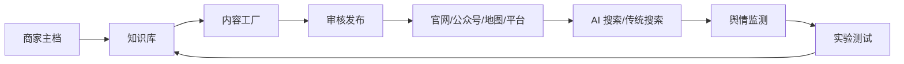

# 商家 GEO 搜索排名落地详细方案

> 版本：v1.1 已接入课程资料  
> 状态：已输出视频分析、单店 SOP 和 JeecgBoot 任务清单  
> 目标：让线下店铺或本地生活商家在 AI 搜索中更容易被识别、被引用、被说对，并持续验证效果。

已接入资料：

- 21 节视频与配套笔记分析：[VIDEO-ANALYSIS.md](VIDEO-ANALYSIS.md)
- 单店 30 天执行 SOP：[EXECUTION-30D.md](EXECUTION-30D.md)
- JeecgBoot GEO 模块开发任务清单：[JEEG-BOOT-TASKS.md](JEEG-BOOT-TASKS.md)
- 视频转写稿：`E:\projects\codex-wk\geo_transcripts`
- 配套笔记：`E:\projects\codex-wk\geo_docs`

代码落地状态：

- JeecgBoot 仓库：`E:\projects\codex-wk\JeecgBoot`
- GEO 后端模块：`JeecgBoot\jeecg-boot\jeecg-boot-module\jeecg-module-geo`
- GEO 前端页面：`JeecgBoot\jeecgboot-vue3\src\views\geo`
- Flyway 建表和菜单：`JeecgBoot\jeecg-boot\jeecg-module-system\jeecg-system-start\src\main\resources\flyway\sql\mysql\V3.9.3_0__geo_module.sql`

## 1. 问题定义

GEO 不是传统 SEO 的简单复制。用户正在从“搜网页、点链接”转向“问 AI、读答案”。商家的排名问题变成：

- AI 在回答“附近哪里好”“XX 城哪家店值得去”“XX 店营业时间”时，是否提到我。
- 如果提到我，是否给对地址、价格、营业时间、口碑和联系方式。
- 如果 AI 需要引用来源，是否愿意引用我的官网、地图页、平台页或真实第三方页面。

因此，本方案不做“投毒”，不伪造评价、不编造引用、不塞关键词，而是建立一套可验证、可引用、可迭代的商家事实资产。

## 2. 核心原则

### 2.1 白帽 GEO 原则

| 原则 | 落地含义 |
|---|---|
| 事实先行 | 所有内容由商家知识库生成，不凭空写“体验”“口碑”“资质”。 |
| 可验证 | 每条关键信息在官网、地图、平台或第三方页面上能找到原文。 |
| 可引用 | 页面用稳定 URL、清晰作者、发布日期、正文明示事实，方便 AI 引用。 |
| 人工审发 | AI 只生成草稿和辅助分类，发布、纠错、回应都必须人工确认。 |
| 持续测量 | 每周记录 AI 回答、引用来源、事实准确率和业务转化变化。 |

### 2.2 不投毒红线

| 禁止行为 | 原因 |
|---|---|
| 伪造评价、销量、到店人数、资质、媒体报道 | 一旦被 AI 引用，风险从营销问题变成事实和安全问题。 |
| 页面隐藏文字、关键词堆砌、门页、跳转页 | 属于传统黑帽 SEO，也会被 AI 搜索引擎降权。 |
| 在公开页面埋 prompt injection 诱导 AI 回答 | 既是技术滥用，也是内容污染。 |
| 批量机器人点赞、评论、收藏、转发 | 制造假互动，容易触发平台处罚。 |
| 结构化数据与页面正文不一致 | JSON-LD 只能描述真实页面，不能用于“骗 AI”。 |
| 自动发布到不允许 API 批量发布的平台 | 违反平台规则，应走官方工具或人工发布。 |

## 3. 总体架构



系统不负责“改变搜索引擎”，只负责：

- 持续维护真实信息；
- 持续产生可被检索和引用的内容；
- 持续发现 AI 答错、漏引、引用过期信息的问题；
- 通过实验判断哪些动作有效。

## 4. JeecgBoot 参考实现

JeecgBoot 适合作为运营后台底座，不建议把搜索算法或 AI 调度塞进单体页面。

| JeecgBoot 能力 | 在 GEO 系统中的用途 |
|---|---|
| 系统管理、用户、角色、权限 | 商家管理员、运营、审核员、客服的权限边界。 |
| 多租户 | 每个店铺一套独立数据和查询集。 |
| 在线表单 | 店铺主档、知识条目、文章、渠道、任务、监测结果。 |
| 数据字典 | 内容类型、事实分类、平台、状态、情绪、严重度。 |
| 定时任务 | 文章发布、监测抓取、周报生成。 |
| 消息通知 | 差评、AI 答错、事实过期、发布失败时提醒。 |
| 文件管理 | 知识库附件、实拍图、视频、证据截图。 |
| 工作流/审批 | 文章审核、渠道发布确认、纠错上线。 |
| 报表 | GEO 周报、mention rate、citation rate、情绪趋势。 |

建议后端仍使用 Spring Boot + MySQL + Redis + Elasticsearch/OpenSearch，AI 通过独立 Provider 层接入。

## 5. 数据模型

### 5.1 核心表

| 表名 | 说明 | 关键字段 |
|---|---|---|
| `geo_merchant` | 店铺主档 | `tenant_id`, `name`, `aliases`, `category`, `province/city/district/address`, `lng`, `lat`, `phone`, `opening_hours`, `status` |
| `geo_knowledge_item` | 知识条目 | `merchant_id`, `category`, `title`, `content_json`, `source_type`, `source_url`, `owner_id`, `verified_at`, `valid_from`, `valid_to`, `status` |
| `geo_article` | 内容草稿/发布物 | `merchant_id`, `type`, `title`, `content_md`, `status`, `review_status`, `reviewer_id`, `published_at`, `canonical_url` |
| `geo_article_version` | 文章版本 | `article_id`, `version`, `content_md`, `changed_by`, `created_at` |
| `geo_channel` | 发布渠道配置 | `merchant_id`, `platform`, `config_encrypted`, `enabled`, `rate_limit`, `status` |
| `geo_publish_task` | 发布任务 | `article_id`, `channel_id`, `status`, `external_id`, `external_url`, `error_code`, `retry_count` |
| `geo_monitor_task` | 监测任务 | `merchant_id`, `query_set_json`, `engine_config`, `cadence`, `enabled` |
| `geo_mention` | AI 回答记录 | `task_id`, `engine`, `query`, `occurred_at`, `answer_text`, `mentioned`, `position`, `source_urls_json`, `accuracy_score` |
| `geo_sentiment_event` | 舆情事件 | `merchant_id`, `platform`, `event_type`, `title`, `content`, `sentiment`, `severity`, `status`, `owner_id` |
| `geo_experiment` | 实验 | `merchant_id`, `name`, `control_group`, `variant_group`, `status`, `started_at`, `ended_at` |
| `geo_metric_snapshot` | 指标快照 | `experiment_id`, `metric_name`, `value`, `period` |
| `geo_audit_log` | 审计日志 | `user_id`, `action`, `target_type`, `target_id`, `before_json`, `after_json`, `created_at` |

### 5.2 关键状态

- 知识条目：`草稿 -> 待核验 -> 已核验 -> 已过期 -> 已停用`
- 文章：`草稿 -> 待审核 -> 已通过 -> 待发布 -> 已发布 -> 已下线 -> 已撤回`
- 发布任务：`排队中 -> 发布中 -> 成功 -> 失败 -> 需人工处理`
- 舆情事件：`待处理 -> 处理中 -> 已闭环 -> 已归档`

## 6. 知识库模块

### 6.1 知识分类

| 分类 | 示例 |
|---|---|
| 实体信息 | 店名、别名、地址、坐标、电话、营业时间、服务范围 |
| 商品/服务 | SKU、价格区间、卖点、使用场景、售后政策 |
| 资质事实 | 执照、许可证、质检、认证、专利、奖项 |
| 口碑资产 | 真实评价、用户提问、经授权案例 |
| 媒体资产 | 实拍图、视频、采访、报道链接 |
| 纠错记录 | 曾经被 AI 答错的信息和修正时间 |

### 6.2 知识条目结构

```json
{
  "fact": "营业时间",
  "value": "周一至周日 10:00-22:00",
  "source": "official_page",
  "source_url": "https://example.com/about",
  "verified_at": "2026-08-16",
  "valid_from": "2026-08-16",
  "valid_to": "2027-08-16",
  "owner": "store_admin",
  "status": "verified"
}
```

### 6.3 可索引输出

- 官网实体页：地址、营业时间、电话、服务范围全部在正文出现。
- JSON-LD：`LocalBusiness`、`FAQPage`、`Article`、`BreadcrumbList`。
- `robots.txt`：按官方名单放行主要 AI 爬虫，例如 `GPTBot`、`OAI-SearchBot`、`PerplexityBot`、`ClaudeBot`、`Google-Extended`。
- `sitemap.xml`：收录实体页、文章页、FAQ 页。
- `llms.txt`：只作为补充，不替代真实页面。
- 地图/平台：百度地图、高德、美团、点评等平台的核心字段必须和官网一致。

## 7. 合规文章生成

### 7.1 内容类型

- 店铺介绍页
- FAQ 页
- 商品/服务选购指南
- 本地生活攻略
- 真实用户案例
- 价格和售后说明
- 纠错和回应页

### 7.2 生成流程

```text
知识库抽取事实 -> 构造事实块 -> LLM 生成草稿 -> 规则检查 -> 人工审核 -> 发布 -> 收录监测
```

### 7.3 生成约束

- 每条文章只使用已核验知识，不编造数据。
- 功效类、医疗类、金融类、教育类内容必须走敏感词库和人工审核。
- 不使用“第一”“最好”“绝对”等无法证明的表述。
- 页面必须有作者、日期、原文链接、内容更新时间。
- 真实案例需要用户授权，并保留第三方平台原文。
- 每篇文章生成后由至少一位不是 AI 的审核人确认。

### 7.4 审核清单

| 检查项 | 是否通过 |
|---|---|
| 地址、电话、营业时间与主档一致 | |
| 价格、优惠、库存信息有来源且未过期 | |
| 评价、销量、奖项可验证 | |
| 敏感词命中已人工处理 | |
| 页面不含隐藏文字和关键词堆砌 | |
| JSON-LD 与正文一致 | |
| 有作者、日期、更新日期 | |
| 发布渠道允许该内容形式 | |

## 8. 媒体平台对接

### 8.1 渠道分层

| 层级 | 渠道 | 对接方式 |
|---|---|---|
| 自有 | 官网、企业站、小程序 | 自动发布，数据库写入即可。 |
| 半自有 | 公众号、视频号 | 官方 API 或后台工具，需审核。 |
| 搜索/地图 | 百度地图、高德地图、美团/点评 | 官方商家后台提交、核验、更新。 |
| 内容平台 | 抖音、小红书、知乎、B站、百家号 | 官方创作平台或开放 API，按平台规则发布。 |
| 第三方 | 媒体报道、博主、探店 | 人工商务合作，保留授权和真实关系。 |

### 8.2 发布任务设计

- 每个渠道维护独立凭证和限频。
- 发布前再次读取平台要求，不绕过审核。
- 发布失败必须保留原始草稿和错误码，不能静默吞掉。
- 记录 `external_url`，用于回填官网、文章引用和监测。
- 同一篇文章可按平台改写，但事实字段保持一致。

### 8.3 自动化和人工边界

| 可自动化 | 必须人工确认 |
|---|---|
| 生成草稿、生成摘要、生成标签 | 发布动作 |
| 检测事实过期、检测差评、检测 AI 答错 | 差评回应、纠错上线 |
| 生成周报、生成实验数据 | 账号绑定、支付、资质提交 |

## 9. 舆情监控

### 9.1 监测来源

- AI 搜索：ChatGPT、Perplexity、DeepSeek、豆包、腾讯元宝、Google AI Overviews、Bing Copilot。
- 传统搜索：百度、Google。
- 本地平台：百度地图、高德、美团、点评。
- 内容平台：抖音、小红书、知乎、B站、公众号。

### 9.2 查询集设计

| 查询类型 | 示例 |
|---|---|
| 品牌词 | `XX店 怎么样`、`XX店 营业时间` |
| 品类词 | `上海 咖啡店 推荐` |
| 推荐意图 | `适合带孩子去的餐厅` |
| 对比意图 | `XX店 和 YY店 哪个好` |
| FAQ | `XX店 停车方便吗` |

建议每个商家维护 30 到 50 条查询，至少覆盖品牌、品类、推荐、对比和 FAQ。

### 9.3 指标口径

| 指标 | 定义 |
|---|---|
| AI mention rate | 提到店铺的查询数 / 总查询数 |
| citation rate | AI 引用店铺相关来源的回答数 / 提到店铺的回答数 |
| 事实准确率 | 地址、电话、营业时间、价格等信息全部正确的回答占比 |
| 来源多样性 | 被引用的官网、地图、平台、第三方来源数量 |
| 情绪 | 正面 / 中性 / 负面 |
| 响应 SLA | 从发现到人工处理完成的时间 |

### 9.4 处理流程

```text
发现异常 -> 分类 -> 判断风险 -> 查证事实 -> 修复知识库/页面 -> 官方渠道回应 -> 归档
```

处理差评、AI 答错和事实过期时，优先修正真实信息，不要求 AI 给指定答案。

## 10. 效果测试

### 10.1 测试原则

- 先建基线，再优化。
- 每次只改变一个变量。
- 用固定查询集、固定频次、固定地区/设备记录。
- 不把单次截图当作结论。
- 对照组和实验组必须在同一市场或同一商家内可控。

### 10.2 实验类型

| 实验 | 做法 |
|---|---|
| 实体页上线 | 上线前后对比 mention rate 和 citation rate。 |
| 结构化数据 | 开启/关闭 JSON-LD 对比收录和准确率。 |
| 文章批次 | 同城两个商家分批发布，比较引用来源。 |
| 纠错实验 | 对错误信息修正后，跟踪下一次 AI 回答。 |
| 渠道实验 | 官网 + 公众号 vs 全渠道，判断增量来源。 |

### 10.3 周报模板

| 项目 | 数值 |
|---|---|
| 查询总数 | |
| mention rate | |
| citation rate | |
| 事实准确率 | |
| 高优先级舆情 | |
| 已闭环事件 | |
| 本周动作 | |
| 下周实验 | |

## 11. 30 天落地排期

### 第 1 周：基线

- D1：确定目标商家、城市、品类。
- D2：建立 30 条查询集。
- D3：记录首批 AI 回答和平台排名。
- D4：盘点官网、地图、平台信息是否一致。
- D5：建立店铺主档和知识库结构。
- D6：整理资质、价格、营业时间、图片素材。
- D7：输出基线报告。

### 第 2 周：知识库和官网

- D8：补全实体页和 JSON-LD。
- D9：提交 `sitemap.xml`，检查 `robots.txt`。
- D10：上线 3 个 FAQ 页面。
- D11：上线 1 个店铺介绍页。
- D12：核验地图和平台 NAP 一致性。
- D13：建立内容审核清单。
- D14：第一次内容发布。

### 第 3 周：渠道和监测

- D15：接入官网/公众号发布。
- D16：提交百度地图、高德、美团信息。
- D17：配置抖音、小红书等平台草稿流程。
- D18：配置舆情监测任务和通知。
- D19：建立差评处理流程。
- D20：第一次 AI 回答复测。
- D21：处理第一轮事实修正。

### 第 4 周：实验和优化

- D22：设置实验组和对照组。
- D23：发布文章批次。
- D24：记录第二次 AI 回答。
- D25：对比 mention rate 和 citation rate。
- D26：修复事实准确率问题。
- D27：输出 GEO 周报。
- D28：确定下月内容计划。
- D29：复盘自动化边界。
- D30：归档并进入循环。

## 12. 风险与自动化边界

| 风险 | 应对 |
|---|---|
| AI 回答不稳定 | 不承诺排名，只看趋势和引用覆盖率。 |
| 平台规则变化 | 定期检查官方规则，不依赖灰色接口。 |
| 事实过期 | 知识条目设置有效期，到期提醒负责人。 |
| 差评扩散 | 用官方账号真实回应，不删评论、不伪造好评。 |
| 内容质量差 | 人工审核优先，AI 只生成草稿。 |
| 数据泄露 | 渠道凭证加密存储，权限按角色隔离。 |
| 过度自动化 | 发布、回应、纠错必须人工确认。 |

## 13. 资料补充与下一步细化

当前已接入 21 节视频、配套笔记、视频转写稿和笔记文本。下一步要真正开工，还需要确认：

- 实际店铺类型、城市和主攻品类。
- 现有官网、公众号、地图、平台账号情况。
- 已有知识库、图片、视频、评价数据。
- 已有 SEO、投放、客服流程。
- 目标查询集或用户提问样本。
- 合规要求和行业资质。
- JeecgBoot 版本和现有模块。

拿到这些信息后，可以把本文档继续细化为“指定商家的 30 天排期”或“JeecgBoot 可开工的模块代码”。
